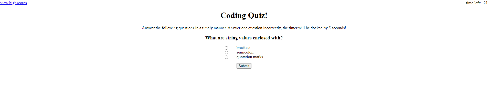

# YC-QuizGame

# Purpose

The purpose is for the user to take the quiz with a 60 second timer in the upper right hand corner. Also a 'View Highscore' in the upper left corner. Once clicking the start button, the timer should start and the quiz will then start. There are two questions on Javascript. If the user clicks on the correct answer, then it will proceed to the next question. If the user answers a question incorrectly, the timer will then subtract 5 seconds off the timer.

Once, all the questions are answered the quiz is over.

# Usage

This Code Quiz is to create a timed quiz while using JavaScript.

# Files Included

* Javascript
* Css
* Html
* README
* Images

# Images

# Credits

Created by Yadira Cervantes with support and help from Stephen, TA Jen Doyle, TA Chris Yang.

# Comments

I definetly plan on coming back to this assignemnt and complete it at a later time. Javascript has been a challenge these past 2 or 3 weeks. 
